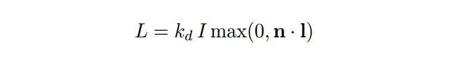
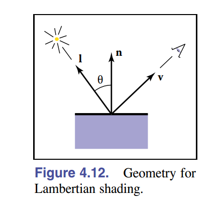
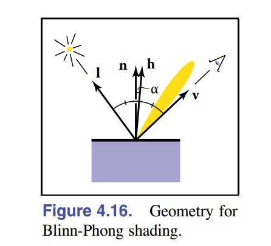
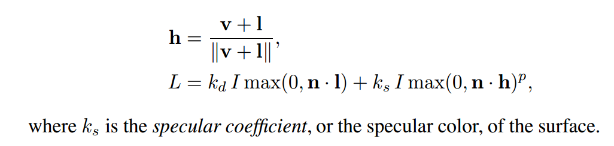
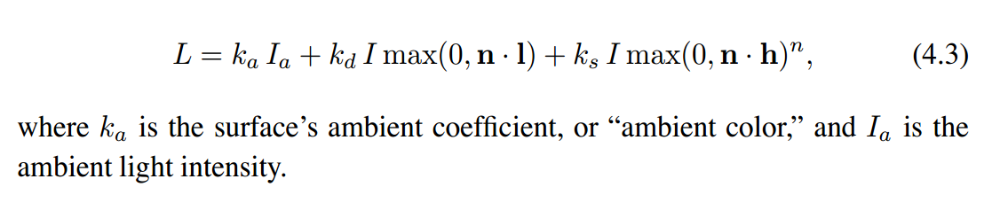

# 计算机图形学第一定律
如果它看起来是对的，那么它就是对的。--《3D Math Primer For Graphics And Game Development》  
(真实世界中的物理细节很复杂，实时渲染里面很难做到这样精细，游戏还分高低画质，不能说低画质就是错的)

渲染总是围绕一个基础问题:我们如何决定一个像素的颜色?

目前绝大多数的渲染都是以传统的光栅化渲染为主(因为这个GPU直接支持，有硬件加速)，光线追踪为辅。光照模型和光线追踪在游戏引擎里面的用处非常重要。

# 图形顺序和对象顺序渲染(image-order and object-order rendering)
从根本上讲，渲染是一个过程，将一组对象作为输入，并产生一个像素阵列作为输出。渲染过程中我们考虑如何渲染一个像素点，分为两种:
* 图片顺序(image-order):针对每个像素点，我们考虑所有的对象是如何影响这个像素点的。
* 对象顺序(object-order):针对每个对象，把每个对象的所有像素点的影响叠加。

# 基本光线追踪
光线追踪是一种图片顺序的3D场景渲染算法。
一个基本的光线追踪器分为三部分:
* 光线生成(ray generation)
* 光线相交(ray intersection)
* 着色(shading)

算法描述如下:
```
for each pixel do
    compute view ray
    find first object hit by ray and its suface normal n
    set pixel color to value computed from hit point, light,and n
```
通常来讲，我们要模拟真实的光照环境来生成一张图像，需要考虑3种物理现象。
* 首先，光线从光源(light source)中被发射出来。
* 然后，光线和场景中的一些物体相交:一些光线被物体吸收了，而另外一些光线被散射到其他方向。
* 最后，摄像机吸收了一些光，产生了一张图片。
当光线由光源发射出来后，会与物体相交。相交的结果有两个:散射(scattering)和吸收(absorption)。散射只改变光线方向，不会改变光的密度和颜色。而吸收就会改变光线的密度和颜色，但是不会改变光的方向。光线在物体表面经过散射后，有两种方向:一种就是散射到物体内部，这种现象被称为折射(refraction)或投射(transmission)。另外一种将会散射到外部，这种现象被称为反射(reflection)。  

为了区分这两种不同的散射方向，我们在光照模型中使用不同的部分来计算:高光反射(specular)/镜面反射(mirror)和漫反射(diffuse)。其中高光反射部分表示物体表面是如何反射光线的。漫反射表示有多少光线会被折射、吸收和散射出表面。

着色指的是，根据材质属性(如漫反射属性等)、光源信息(如光源方向，辐照度等)，使用一个等式去计算沿某个观察方向的出射度的过程。我们把这个等式称为光照模型

# 光照模型
## Lambertian光照模型/纯漫反射
光线落在表面上的能量多少取决于光线和表面的角度,直接面向光的表面可以获得最大照度，与光线相切或者背光的表面不获得光照。在这两种之间的光照强度满足Lambertian模型:  

其中L是像素颜色，kd是漫反射系数或者表面颜色，I是光照颜色,n和l分别是表面单位法线和光线方向(单位向量)    
n和l的如下图所示:

Lambertian模型里面的max(0, n . l)是为了防止法线和光源方向点乘的结果为负值，防止物体被从后面来的光源照亮。

## Lambertian的局限
Lambertain的表面颜色和视角无关，许多真实表面会显示一定程度的光泽，产生高光或者镜面反射,这些都会随着视角变化而移动。lambertian着色并不会产生高光，所以物体表面没有光泽。

## Blinn-Phong光照模型/高光反射
图示:

公式:

## Ambient光照模型/环境光

添加了Ambient光照的模型



## 标准光照模型
标准光照模型只关心直接光照，也就是那些直接从光源发射出来照射到物体表面后，经过物体表面反射后直接进入相机的光线。这些光线分为4个部分:
* 自发光(emissive):给定一个方向，一个表面会向该方向发射多少辐射量的光。注意:如果没有全局光照技术，这些自发光的表面并不会真的照亮周围的物体，而是他本身看起来更亮
* 高光反射(specular):当光线从光源照射到模型表面时，该表面会在完全镜面反射方向散射多少辐射量。
* 漫反射(diffuse):当光线从光源照射到模型表面时，该表面会向每个方向散射多少辐射量。
* 环境光(ambient):用于描述其他所有的间接光照，光线会在多个物体直接反射，最近进入摄像机。

公式:

## 标准光照模型的局限性
首先，很多重要的物理现象无法用Blinn-Phong模型表现出来,例如菲涅尔反射(Fresnel reflection)。其次，Blinn-Phong模型是各向同性(isotropic)即固定视角和光源方向旋转这个表面，反射不会发生任何改变。但是有些物体的表面是各向异性(anisotropic)的，例如金属(参照高中化学晶体的各向异性)。所以在这种情况下就会用到基于物理的光照模型。

# 透视投影
把3D对象在2D平面展示出来是用的线性投影，最简单的投影是平行投影,把3D物体沿着平行线投影方向映射到2D。但是这种方法有很明显的缺陷，以我们日常经验，物体越远看起来就越小并且平行的线也会变得不平行。所以还有一种投影方法就是沿着穿过某个点的线进行投影，这个点就是我们的视角(viewpoint)。而3D物体也会被投影到我们视角(眼睛)前面的2D平面上(电脑屏幕)。

# 计算光线
为了产生光线，我们需要一种数学方式来展现光线，我们仅仅需要起始点和方向，光线可以表示为p(t) = e + t(s - e);e是眼睛，s是目的地，就是沿着s-e的方向,t参数就是表示自变量,p(0) = e, p(1) = s, 如果t<0表示p(t)这个点在我眼睛的后方

## 正交视图

## 透视图 

# 光线和对象相交
## 光线和球体相交
球体的数学表达：球心c = （xc, yc, zc)，半径R，球的曲线方程为(x - xc)^2 + (y - yc)^2 +  (z - zc)^2 = R^2,即(p - c) . (p - c) - R^2 = 0。所有满足方程的点p都在这个球面上。  
我们把光线方程p(t) = e + td代入点p，即(e + td - c) . (e + td - c) - R^2 = 0,变形为(d.d)t^2 + 2d .(e-c)t + (e-c).(e-c) - R^2 = 0  
我们可以根据求根公式At^2 + Bt + C = 0.判断B^2 - 4AC的值如果<0，说明光线和球体不会相。如果>0说明有两个解，其中一个解是光线进入这个球体的点，另外一个解是光线穿过球体离开的点(球体允许光线穿透)。如果=0，说明我们的光线和球体相切。求出来的t可以带入光线方程算出具体点的坐标。

## 光线和三角形相交

## 光线和多边形相交

## 关系
* 光线追踪与光照模型的关系
* 物理材质与光线追踪的关系
* pbr和一般光照模型的区别

# 参考文献
《Fundamentals of computer Graphics》4th edition
《Ray Tracing in One Weekend》
《Unity Shader入门精要》
