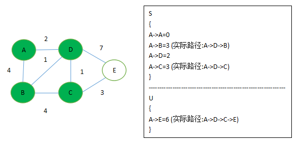

# 需求
现在在任务界面有个目的地址(地图，x,y坐标),如果玩家打开任务界面点击目的地址就让地图上人物一步一步移动到目的地址，人物可以在任意一个地图的任意一个位置打开这个任务界面，目的地址也可以是任意一个地图的任意一个位置。简化一下就是说现在需要做一个功能，需要玩家从任意一个地图的任意一个位置移动到另外任意一个地图的任意一个位置。

# 解决方案
关于这个问题的方案，我认为分成两大块，人物在单个地图内的移动，和人物在地图间的移动  

1.怎么在一个地图里面找到人物从一个点移动到另外一个点，这里有一个应用比较广泛成熟的方案,A*算法,当然这里还有其他的解决方案，搜索算法有很多种。 

2.玩家从地图A移动到地图B(A->...->C->...->B)，怎么确定从地图A要先到哪些中间地图才能到达目的地图，这个放后面说。

## 单个图里面的寻路算法
这里有一图，图里有两个结点，a和b，从a到b有很多条路可以走，但是哪条路是最短的呢，这里有多种算法可以解决这个问题。
### Dijkstra算法
Dijkstra算法的目的是在一个图里面找到一个结点到其余结点的最短路径算法，Dijkstra的核心思想是贪心算法，Dijkstra算法要求所有边的权值(代价)非负。主要特点是以起始点为中心向外层层扩散，直到扩散到终点为止  

#### 算法思想:
设G = (V, E)是一个带权有向图，把图中顶点分成两部分,第一部分是集合S,另外一部分是V - S。其中从源结点s到S中的每个结点的最短路径已经被找到。算法重复从结点集V - S中选择最短路径最小的结点u，将u加入到集合S，然后对所有从u出发的边进行松弛(对u的相邻结点的最小路径进行更新)。  

#### 伪代码
```
//初始化
INITIALIZE-SINGLE-SOURCE(G, s)
    for each verter v of V[G]
        d[v] <- INF//无穷大
        parent[v] <- NULL
    done
done
/*
初始化后，对所有v属于V，parent[v] = NULL,对v属于{V - {s}}，有d[s] = 0 以及d[v]=无穷。松弛一条边(u, v)，如果这条边可以对最短路径改进，则更新d[v]和parent[v]。一次松弛操作可以减少最短路径估计的值d[v]，并更新v的前趋域parent[v].下面的伪代码对边(u, v)进行了一步松弛操作
*/
//松弛操作
RELAX(u, v, w)
    if d[v] > d[u] + w(u, v)
        d[v] <- d[u] + w(u, v)
        parent[v] <- u
    fi
done

DIJKSTRA(G, w, s)
    INITIALIZE-SINGLE-SOURCE(G, s)
    S <- 空集
    Q <- V[G]
    while Q != 空集
        u <- EXTRACT-MIN(Q)
        S <- S && {u}
        for each vertex v of Adj[u]
            RELAX(u, v, w)//松弛
    done
done

/*
EXTRACT-MIN(Q)这个操作是从Q集合中选择最小边的结点,体现了贪心选择的策略，可以利用优先队列数据结构优化
*/

```

#### 图解
1.首先有个带权图如下，求解结点A到其他结点的最短路径  
  

2.选定结点A并初始化
  
3.执行EXTRACT-MIN(Q)操作，找出Q集合中路径最短的结点D 加入S集合，并对S中的D结点的相邻结点进行松弛操作  
  
4.接下来选边最小的B和C都可以,假设选B
  
5.然后选中C  
  
6.最后选中E

这里Q就是图里的U,Q为空了算法结束。 
如果相求A->E的路径，就从E结点，然后找到他的parent,然后parent，直到找到起点A，然后反过来输出就是A->D->C->E

### A*算法
A\*算法是一种启发式搜索，是带条件的搜索，会根据启发式函数选举的不同来引导算法朝向某个方向进行搜索，相比于Dijkstra算法来讲，A\*搜索更具有目的性，一上来就直接朝着目标前进，而不是像Dijkstra从初始点起一圈一圈的向外扩散搜索(Dijkstra是广度优先搜索)，所以A\*的效率比Dijkstra的效率更高。

#### 算法原理
A\*算法就是在Dijkstra算法的基础上加上启发式函数，可以用公式f(n) = g(n) + h(n)来表示，f(n)被用作EXTRACT-MIN(Q)这步操作的贪心策略。其中g(n)表示结点n离起始点的代价，h(n)表示离终点的代价,这里的代价可以指路径。其中h(n)就是启发式函数，他不是一个真实的值，是一个估值，当然，h(n)离真实值越接近，算法就越快。如果把启发式函数h(n)设为0, 那么这里就是选择到起始点路径最小的结点了，A\*也就退化成Dijkstra算法了。

这里也采用两个集合，OPEN和CLOSE，其中OPEN表示待检测的结点，CLOSE表示检测完的结点。这里和Dijkstra算法不同的是，Dijkstra算法会把所有的结点都检测完，这里不会，这里只检测一部分结点就能得出最短路径。  

算法逻辑如下:  

刚开始时，OPEN只有一个元素，就是起始结点，CLOSE是空的，每个结点在保存的时候会同时保存其父结点的指针来告诉我们这个结点是通过什么结点找到这里来的。

然后在主循环中反复地从OPEN中取出最好的结点n(f值最小的结点)并检查之，如果n是目标结点，则找到了目标结点算法结束。否则我们把结点n从OPEN中删掉，然后把加入到close集合。然后检查他周围的点n’，如果n'在CLOSE中就表示这个结点已经被检查过了，我们的不需要考虑它了，如果n'在OPEN中那么他在以后的检查中肯定会被检查到的，所以我们现在不考虑它，否则n’既不在OPEN也不在CLOSE，我们把它加入到OPEN中，并且把它的父结点设置n，到达n'的代价为g(n')，那么g(n') = g(n) + movementcost(n, n')，即n'到起始点的代价为n到起始点打代价+n到n'的代价。

#### 伪代码

```
OPEN = priority queue containint START
CLOSE = empty set

while lowest rank in OPEN is not the GOAL:
    current = remove lowest rank item from OPEN
    add current to CLOSE
    for neighbors of current:
        cost = g(current) + movementcost(current, neighbor)
        if neighbor in OPEN and cost less than g(neighbor)
            remove neighbor from OPEN, because new path is better
        if neighbor in CLOSE and cost less than g(neighbor)
            remove neighbor from CLOSE
        if neighbor not in OPEN and neighbor not in CLOSE
            set g(neighbor) to cost
            add neighbor to OPEN
            set priority queue rank to g(neighbor) + h(neighor)
            set neighbor's parent to current

reconstruct reverse path from goal to start by following parent pointers
```

#### 图解

还没写完，待续...... :)

#### 启发式函数带来的好处

还没写完，待续...... :)

### A*和Dijkstra的比较
A\*通过启发式函数来减少了搜索的面积，比Dijkstra稍微快点，但是这样可能会导致A\*最终找到的路径不是最短路径，而是一个接近最短路径的一个路径，Dijkstra一定会找到最短路径。具体A\*的结果是不是最优的解，是需要根据启发式函数h(n)来确定。


## 跨越地图的寻路

还没写完，待续....... :)