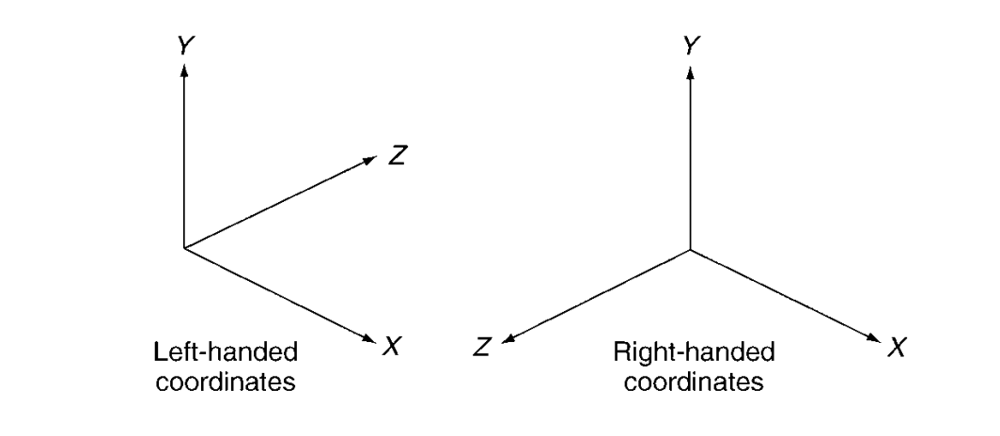
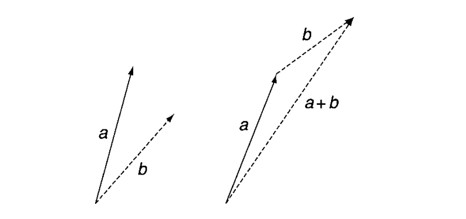

# 基础知识
## 空间向量vector
### 坐标系

右手定则坐标系:openGL, PlayStation  
左手定则坐标系:DirectX, unreal engine(z轴向上), unity  

向量a[x1, y1, z1]表示一个点的坐标  
向量v[vx, vy, vz]表示一个点的速度

### 向量的运算
a = [ax, ay, az];  
b = [bx, by, bz];
1. 模和单位向量  
|a| = sqrt(ax ^ 2 + ay ^ 2 + az ^ 2)  //向量a的模,向量a的长度  
a^ = a/|a|  //打字没法打单位向量, 就用a^代替
2. 加减法  

向量加法就是两个向量收尾相连，然后从加起点指向尾端
向量减法就是起点相同,被减向量的终点指向减向量的终点  
a-b即b的终点指向a的终点
3. 乘除法(向量乘除常量)  
c = 5 * a = [5 * ax, 5 * ay, 5 * az];  
d = 1/5 * a = [1/5 * ax, 1/5 * ay, 1/5 * az];
4. 点乘  
e = a . b = ax * bx + ay * by + az * bz = |a| * |b| * cosθ  
e是一个标量，不是向量，θ是向量a,b的夹角， 如果θ是个钝角，a . b是负值，如果θ是直角，a . b = 0
θ = arccot((a.b)/(|a| * |b|))可以根据点乘来求解两个向量的夹角  
5. 叉乘  
f = a x b = [ay * bz - az * by, az * bx - ax * bz, ax * by - ay * bx]//叉乘在三维中的作用是求向量a和b的正交方向,即垂直a和b构成这个面的方向  
|f| = |a|*|b| * sinθ

## 牛顿三大定律
1. 任何物体都要保持匀速直线运动或静止状态，直到外力迫使它改变运动状态为止  
2. 物体加速度的大小跟作用力成正比，跟物体的质量成反比，且与物体质量的倒数成正比；加速度的方向跟作用力的方向相同(f = ma)
3. 相互作用的两个物体之间的作用力和反作用力总是大小相等，方向相反，作用在同一条直线上

## 位置计算  
位置公式:
p' = p + v * t + a * t^2 / 2;  
计算物体在下一帧的位置只需要知道几个参数:  
1. 初速度  
2. 物体所受到的力  
3. 物体的质量
# 单个粒子，如子弹
## 阻尼damping
根据牛顿第一定律，如果一个运动的物体在没有外力的作用下会一直运动下去，但是现实中不存在这种情况，因为存在摩擦力。所以在物体运动过程中物体的速度会一直降低直到为0。
在游戏中一种简单的做法并不是给物体加上一个摩擦力，而是给速度加一个阻尼参数damping(0-1之间,0表示巨大阻力，1表示没有阻力),然后速度在每次更新的时候会变成原来的damping倍,经过大量验证，一般damping的最佳值是0.995。

## 重力  
众所周知，地球上的重力加速度是9.8m/s^2，重力f = mg;

## 合力
当一个物体受到多个力，在每个力的共同作用下的运动和在这些里相互抵消加成得出的合力作用下的运动是完全一致的。
所以在计算一个物体下一帧应该出现的位置我们只需要知道他所受到的合力的大小就好了。因为这些力都是向量表示的矢量，所以把所有的力按照向量的加法加起来就是合力了。

## 力量的来源--力生成器(force generator)
一般来讲，物体受到的力很复杂，同时受到多个力，并且每个力的作用时间也不一样，像爆炸的冲击力就很短暂，说不定在下一帧这个力就消失了，像重力这种就会一直存在。所以单个计算每个力的加速度对物体造成的影响是一件很麻烦的事，所以我们需要工具来计算管理这些力。  
类似于工厂模式，对每种类型的力的计算采取封装，如果需要某个力，就创建一个这种力的工厂。
举个例子:一个自由落体的物体，他此时受到一个恒定的重力和空气阻力  
重力:f = mg //g = 9.8 m/s^2  
阻力:f = -(k1 * v + k2 * v^2) //k1,k2是两个常数，当速度越大的时候空气阻力就越大，上面的阻尼是一种比较简单的处理方式  
我们给这个物体加了两个力量工厂生成这两个力，传入需要的参数，然后我们就不用管这些力是怎么变化的，什么时候消失的，这两个力量会自己根据物体的质量速度去更新，我们只需要每帧去获取当前的力是多少就可以了，然后把所有的力量通过向量的加法合并成一个合力，然后就可以直接算出物体下一帧的位置。

# 多个粒子 如烟花，爆炸，烟雾
就拿烟花来举例子，对于烟花这种粒子，这个粒子本身就有个生命时限的。并且对于这种爆炸来说是有个引爆时间的，时间到了才会开始爆炸，然后爆炸也有个持续时间，完成之后就烟消云散了。
## 烟花规则
要定义复合烟花的效果，该烟花就要由好几种效果组成，比如烟花升空的时候的效果，炸开时候的效果，以及再次炸开的效果，我们需要指定一种粒子怎么变成另外一种粒子。所以我们按照一种规则来执行此操作，对于每种烟花类型，我们都存储一个时间，这一组粒子在经过该时间后将生成其他类型的烟花数据。  

一般来讲，完整的游戏引擎会提供相关的编辑工具给策划美术人员来创建粒子的外观和行为。然后代码就会读取这些配置生成这些粒子的规则，然后代码在运行的时候粒子就获取到他的参数，如初速度、质量、加速度，然后就开始计算粒子系统接下来的表现。

# 一些让步
在游戏中有些情况又和现实中的不一样, 就比如上面的子弹运动，现实中子弹的运动速度一般都在音速上下，也就是340m/s，更有变态的子弹速度甚至超过1000m/s，但是游戏里面的子弹有的是没有这么快的(看游戏的玩法吧)，有的子弹速度就被降低到几十米每秒(这种情况是存在的),但是我们知道，物体的速度降低了，他所携带的能量就降低了(以后碰撞检测会用的)，比如一颗50g的子弹以500m/s的速度是可以打穿车门的，但是如果把子弹速度降低到50m/s就打不穿了，这种情况会给玩家带来和现实不一样的体验。  

一般在游戏引擎里面，如果有必要降低物体的运动速度，那么相应的我们就要改变物体的质量，以便物体本身的能量不变。根据动能公式E = (m * v^2) / 2;如果速度降低10倍，那么为了保证能量不变，我们会把物体的质量增加100倍以达到和原来相同的子弹威力效果。

# 总结
对于一个粒子的运动最主要的就是根据公式p' = p + v * t + a * t^2 / 2来计算粒子下一帧位于什么地方，已知的初始位置，初速度，质量，只需要知道粒子的受力情况就可以求出粒子的运动轨迹。  
对于粒子系统无非就是大量粒子的合计，每个粒子还是遵循上面的运动规则，这个粒子系统自己也有个规则，怎么生成，怎么转换消失。

# 参考文献
《Game Physics Engine Development 2nd edition》
# demo
https://github.com/idmillington/cyclone-physics/   