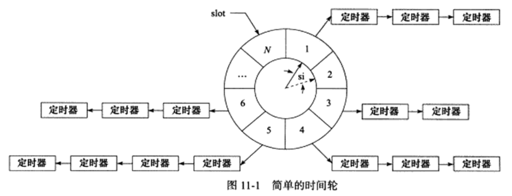

#时间轮  
时间轮是一种高效利用线程资源来进行批量优化调度的一种调度模型，把大批量的调度任务全部都绑定到同一个调度器上，使用这个调度器来进行所有任务的管理，触发以及运行。能够高效的管理各种延时任务，周期任务，通知任务等。  
以下是一个时间轮的图示:

在这个时间轮里面，有个指针指向轮子上的槽(slot)。这个指针以恒定的速度顺时针转动，每转动以下就指向下一个槽，每次转动称为一个嘀嗒(tick)。一个嘀嗒时间称为时间轮的槽间隔si(slot interval)。这个时间轮有N个槽，所以这个时间轮转一圈的时间是N\*si，每个槽里面是一个定时器的链表，每个链表里面的定时器都具有相同的特点:它们的定时时间想差N\*si的整数倍。时间轮正是利用这个关系把定时器散列到不同的链表中。假如现在指针指向槽cs,我们要添加一个定时时间为ti的定时器，则该定时器将被插入槽ts(timer slot)对应的链表中:  
    ts = (cs + (ti / si)) % N  
要提供定时精度，就要使si值足够小。要提高执行效率，就要N值足够大
